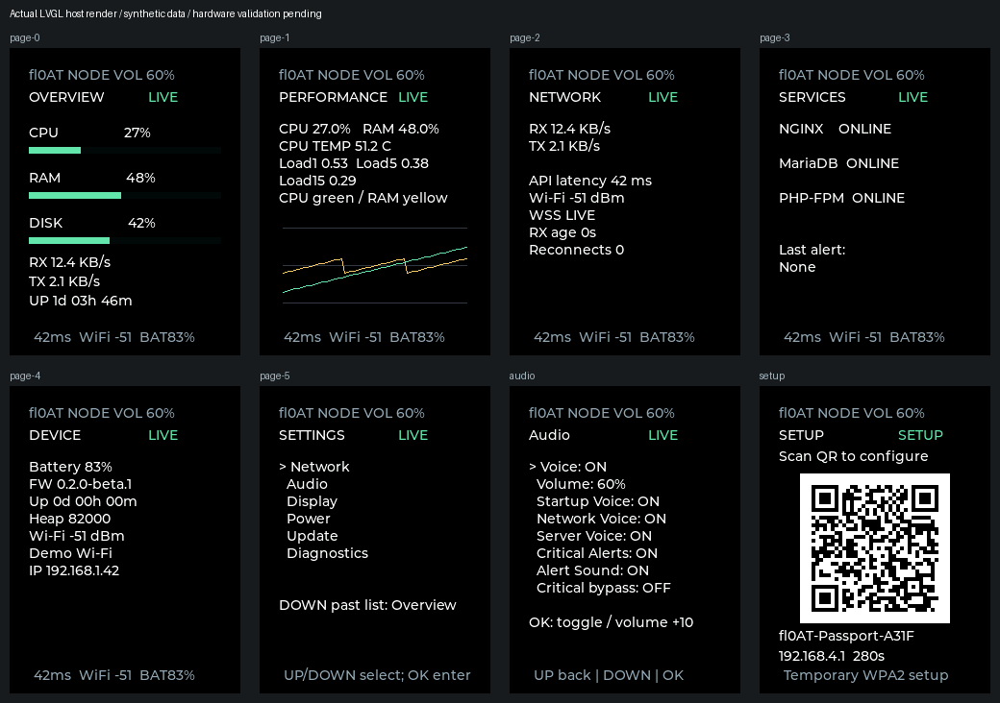

[简体中文](README.zh_CN.md)

# fl0AT AI Passport Server Monitor

**v0.2.0-beta.1 — Architecture Rewrite. Hardware validation pending.**

Independent ESP32-C3 firmware for the FoloToy AI Passport: 8 MB Flash, no PSRAM,
240 x 320 ST7789 display, CW2017 battery gauge and ES8311 speaker. Official BSP
pins and drivers are retained. The only linked application entry is Server Monitor;
no course schedule or official demo menu is in the firmware. MIT; see [LICENSE](LICENSE).

## Connection and protocol

WSS Primary (`wss://status.dyhcn.com/ws`) and HTTPS Polling Fallback
(`https://status.dyhcn.com/api/v1/status`) share one validated ServerState.
Both addresses are configurable. The [server agent](server/README.md) samples once
per second and broadcasts its cached snapshot every two seconds. REST reads the
same cache. Nginx terminates HTTPS/WSS; the agent listens only on 127.0.0.1:8765.
Both routes require an Authorization Bearer header; tokens never go in URLs.

Protocol 1 uses `v`, `type`, `seq`, `timestamp`. `status` and `alert` are implemented.
`service`, `message`, and `update_available` are reserved and ignored safely;
OTA availability is currently checked through the manifest. Temperature may be
missing or null and displays `--`. Other required fields are checked atomically;
invalid input preserves the last good state. See [status.example.json](server/status.example.json).

WSS uses Espressif's pinned client, CA bundle and hostname validation. Ping interval
is 20 seconds, pong timeout 10 seconds, and 30 seconds without accepted application
data forces a fresh connection even if pongs still arrive. Reconnect base delays
are 1/2/4/8/16/30 seconds, with 0–10% downward jitter. Three failed connections enable
HTTPS polling every 10 seconds while WSS recovery continues. A fresh WSS message
restores LIVE. Data becomes STALE after 15 seconds and OFFLINE after 60 seconds;
values remain visible. HTTPS latency measures request time, not ICMP or WSS RTT.

## First boot and QR provisioning

Without valid NVS configuration, setup starts automatically. Hold OK at any time
to reopen setup. Scan the Wi-Fi QR to join `fl0AT-Passport-XXXX`, a temporary WPA2
AP with a random password. The QR contains only ephemeral AP credentials. Open
`http://192.168.4.1` if the captive portal does not open automatically.

The setup page provides scanned networks, SSID/password, server host, WSS/HTTPS
URLs, API token, device name, POSIX timezone and default volume. Enter a 2.4 GHz
WPA2-compatible network and a random 32–128 character token. Save & Connect validates
and commits one NVS blob before closing the portal and connecting STA. Failed saves
retain prior settings. Setup closes after five minutes and allows one phone.
The screen never prints saved passwords or tokens; the temporary key is encoded
only in the QR. A per-session nonce protects setup POSTs. DNS answers are restricted
to the AP subnet; the STA is disconnected during setup. No automatic NVS erase occurs.
The old configuration blob is read for migration without deleting it.

## Pages and controls

Black/white terminal UI with green/yellow/red indicators, fixed widgets and no
screen recreation during updates. ASCII text avoids missing emoji/Chinese glyphs.

| Page | Information |
| --- | --- |
| Overview | CPU/RAM/disk bars, RX/TX, uptime, connection, RSSI, battery |
| Performance | CPU and RAM, nullable temperature, load averages, two-minute trends |
| Network | Rates, HTTPS latency, Wi-Fi RSSI, WSS message age, reconnect count |
| Services | Nginx/MariaDB/PHP-FPM online/offline, most recent alert |
| Device | Battery, firmware, uptime, heap, Wi-Fi, IP |
| Settings | Network, Audio, Display, Power, Update, Diagnostics |

UP/DOWN change pages; OK requests a fallback refresh. Hold DOWN opens Settings.
Hold UP toggles mute. Hold OK starts setup. In Settings use DOWN to select and OK
to apply; UP returns from a section. At the main settings list, DOWN past the last
entry returns to Overview. Audio volume advances in steps of 10 and wraps to zero.
Any button wakes a blank/dim screen; that first press is consumed. Brightness is
10–100%; screen timeout is Never/30s/1m/5m/10m. Live keeps WSS when the screen blanks;
Balanced dims to 10% and keeps WSS; Battery Saver closes WSS while ambient and polls
HTTPS every 60 seconds. These are display/network policies, not deep sleep.

## Audio and alerts

17 locally synthesized Chinese voice clips are stored in SPIFFS VoiceFS as
16 kHz mono G.711 mu-law (754,080 payload bytes). Streaming expands 256 bytes into
512 bytes of PCM; the BSP controls ES8311 playback volume. No speech is synthesized
on the MCU and no giant PCM C arrays are linked. See [asset notes](docs/assets/server-monitor-architecture.md#audio).

A dedicated worker drains bounded INFO/WARNING/CRITICAL queues. Higher priorities
clear lower waiting queues and preempt playback at the next 16 ms chunk. Normal
voice cooldown is 30 seconds; critical is 60 seconds. First sync speaks once per
boot, regular snapshots remain silent. Settings persist voice enable, volume,
startup/network/server/critical categories, alert sound and critical bypass mute.
Bypass defaults OFF and explicit mute is respected. CPU/RAM/disk >=90% produces
edge alerts; returning below 90% rearms that source. Authenticated server alerts
also appear on screen and use severity-appropriate voice.

## OTA and diagnostics

Two 3 MB OTA slots, NVS, OTA data, VoiceFS and coredump fit the 8 MB layout.
[Architecture and partition analysis](docs/assets/server-monitor-architecture.md)
describe the migration and memory budgets. Settings / Update fetches
`https://<configured API origin>/firmware/manifest.json`; a second confirmation
on the device is needed to install an available version. The manifest requires
version, same-origin HTTPS URL, SHA-256 and app-only image size. The worker pauses
WSS, checks TLS, size, hash, ESP image/chip/project and version before selecting
the new slot. Version format is `major.minor.patch` or `major.minor.patch-beta.N`.
Newer versions only; no redirect or cross-origin token forwarding. A successful
boot requires NVS, display/UI progress and running network task before marking
valid. ESP-IDF rollback is enabled. A first migration from the old factory layout
requires a separately authorized partition-table update; it cannot be delivered
as an ordinary app-only OTA. VoiceFS is not updated by app-only OTA.

Diagnostics shows firmware/uptime, free/minimum heap, largest block, RSSI/IP,
WSS age/state, HTTP latency, reconnects, server, last error, audio queue/errors
and dropped events. Coredumps and private logs remain local and can contain secrets.
No firmware manifest or binary has been deployed to the live server by this task.

## Build and validation

Activate ESP-IDF **5.5.3**; LVGL is pinned to **9.5.0** and WebSocket client to **1.6.1**.
Version comes from [version.txt](version.txt). Install Python test dependencies, then:

```sh
python -m pip install -r server/requirements.txt
./tools/validate.sh --static
./tools/validate.sh --firmware
# Or run the complete gate:
./tools/validate.sh
```

Native Windows uses the same entry through Git Bash with an activated IDF Python,
CC and actionlint. The adapter builds in a fresh validation directory using tracked
defaults, merges all listed partitions, verifies bounds/bytes/ELF identity, and
archives `build/firmware/<SHA256>/`. Output: `build/FoloToy-AI-Passport-full.bin`.
Use `python tools/archive_firmware.py verify <bundle>` to verify the archive.
The matching `voicefs.bin` also remains in the validation directory; the merged
image contains it. Binaries, ELF, MAP and private config stay local. CI runs the
complete gate, with no artifact upload or release publishing.

Host tests cover protocol validation, missing/null/invalid data, fragmentation,
state retention and transport transitions, alert edges, cooldown/priority,
volume/ring bounds, formatting, version/manifest parsing, audio decoding and
HTTP/WSS authentication/broadcast. They cannot establish hardware stability.
**Hardware validation pending.** Screen readability, QR scanning, audio quality,
heap under simultaneous TLS/audio, stack watermarks, real Wi-Fi failures, OTA power
loss/rollback and battery drain remain untested on the board.

## Security and release policy

No built-in Wi-Fi credentials, API token or private keys. TLS verification stays
enabled; SNTP must establish time before monitoring. JSON is bounded at 4096 bytes,
with depth, type/range and duplicate-key checks. Unknown message types cannot execute
commands. Credentials are atomically stored but NVS is not encrypted in this beta;
physical flash access can reveal them. Secure boot/encryption provisioning is
outside this release. No eFuses or real device settings are changed.

Before each commit/push run `python tools/check_repo.py`,
`python tools/check-monitor-secrets.py` and review the staged diff. Public release
is a GitHub **Pre-release of source only**, with no firmware assets. See
[CHANGELOG](CHANGELOG.md). **Device flashing is prohibited in this stage**: no flash,
erase, bootloader reset, serial connection or NVS clearing is performed. A later
explicit authorization is required before any device operation.

After dependency resolution, `python tools/test-monitor-ui.py` renders the actual
LVGL pages with synthetic data, a configured 32 KiB pool and BSP-sized partial
buffer. Its PPM outputs remain in `build/ui-validation/`; it does not operate a device.


